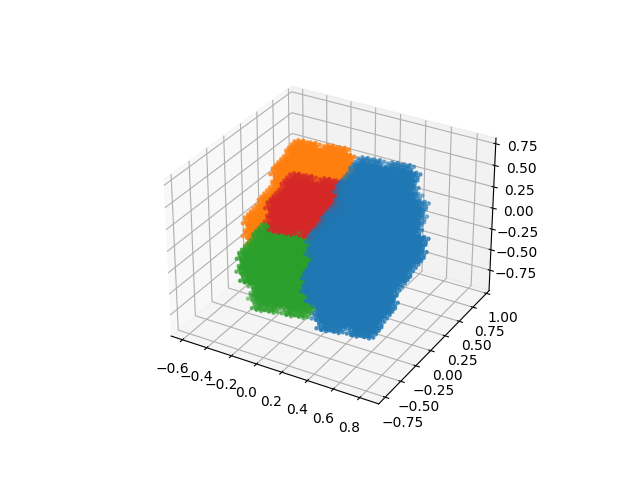

# Simulating Rauzy Fractals

## How to run


You can create image of Rauzy fractal in 2 or 3-dimensional figures.

```
from rauzy import Rauzy

r = Rauzy([[0, 1], [0, 2], [0]])
r.run(20)
r.draw(sz=2)
```

```
r = Rauzy([[0, 1], [0, 2], [0, 3], [0]])
r.run(15)
r.draw(sz=5)
```



