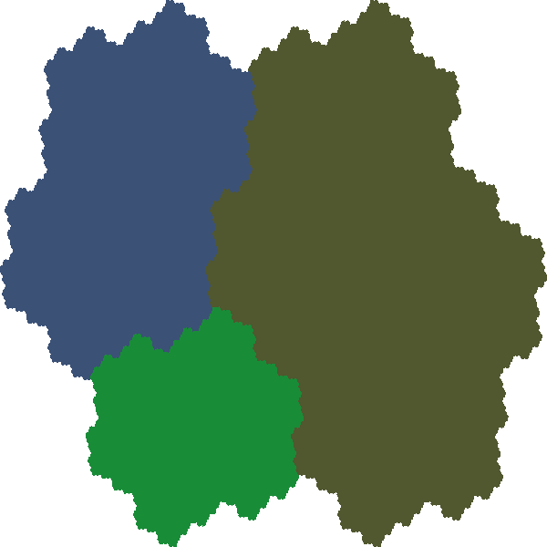

# Simulating Rauzy Fractals

## How to run

### GO version (rauzy.go)

For tribonacci sequence, you create an image file.

```
func main() {    
    r := NewRauzy(3)
    p := map[int64][]int64{
	    0: {0, 1},
	    1: {0, 2},
		    2: {0}}
    r.SetSub(p)
    r.Run(25)

    r.Print()
    r.Png("rauzy.png")
}
```


For fourbonacci sequence, you can create the list of projected points.

```
func main() {    
    r := NewRauzy(4)
    p := map[int64][]int64{
	    0: {0, 1},
	    1: {0, 2},
	    2: {0, 3},
	    3: {0}}
    r.SetSub(p)
    r.Run(10)

    r.Print()
    r.Points("points.csv")
}
```

### Python version (rauzy.py)

You can create image of Rauzy fractal in 2 or 3-dimensional figures.

```
from rauzy import Rauzy

r = Rauzy([[0, 1], [0, 2], [0]])
r.run(20)
r.draw(sz=2)
```

```
r = Rauzy([[0, 1], [0, 2], [0, 3], [0]])
r.run(15)
r.draw(sz=5)
```


